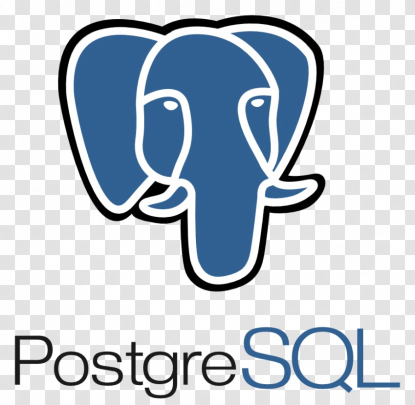

### Hi there 👋

<!--
**TegveerG/TegveerG** is a ✨ _special_ ✨ repository because its `README.md` (this file) appears on your GitHub profile.

Here are some ideas to get you started:

- 🔭 I’m currently working on Ploomber's open-source JupySQL package! I am testing and augmenting the package's functionality as well as building an “End-to-End Data Apps with SQL and Jupyter” course.

- 🌱 I’m currently learning software engineering and documentation skills.

- 👯 I’m looking to collaborate on issues pertaining to complex data problems.

- 💬 Ask me about anything AI!
- 📫 How to reach me: [!Email] 
- 😄 Pronouns: ...
- ⚡ Fun fact: ...
-->

### Hi there 👋

- 🔭 I’m currently working on using Postgres SQL and Python in building a diverse assets portfolio of stock and cryptocurrencies.   

- 🌱 I’m currently learning about how to use Python to build various algorithmic trading strategies.  

- 👯 I’m looking to collaborate on anything that involves using Python to create solutions for finance.   

- 💬 Ask me about: 
           How to get started with Python for finance. 
           Investing in listed and unlisted companies. 
           Accounting and Finance. 

- 📫 Feel free to connect and reach out:  

<h3 align="left">System:</h3>

 
    

<h3 align="left">Languages:</h3>

 
     
     
           
           

<h3 align="left">Python packages:</h3>

 
    
     
    
           

<h3 align="left">Tools:</h3>

     
     
    
            
         
        
        

<h3 align="left">Stats:</h3>

